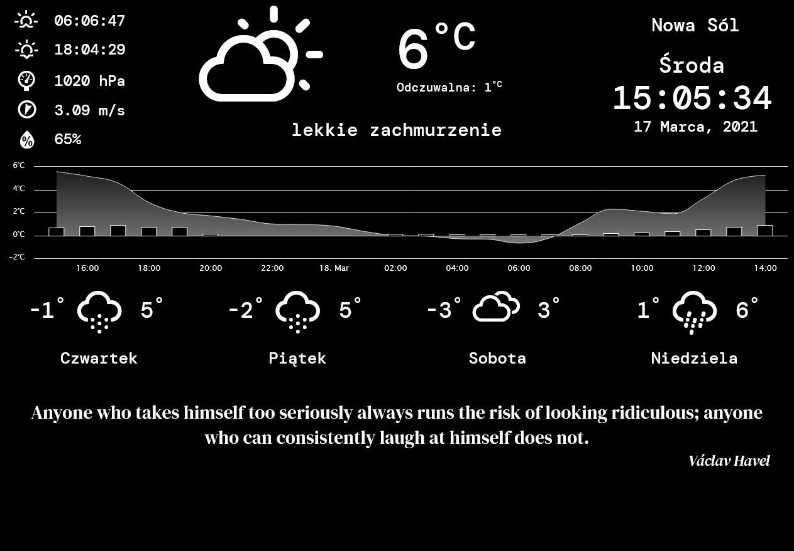

# Smart Mirror Magic Mirror Browser App With Charted Forecast and Quote

Using OpenWeatherMaps / Geolocation / Wikiquotes This app is meant to function in-browser on older mobile devices 
Updated every 15 minutes:

- geolocation
- sunrise & sunset hour
- atmospheric pressure
- wind speed in m/s and wind direction (pointing from)
- humidity
- current temperature with an appropriate icon from Erik Flowers' Weather Icons Set + description in words
- town
- weekday
- hour & date
- quote from english language wikipedia

Updated every 30 minutes:

- four day forecast with minimum and maxiumum temperatures + icons
- 24hour chart with rainfall and temperatures (extendable up to 48hrs)

Tested on Android 4.0.4 and upward (on 4.0.4 fullscreen doesn't work yet).

Clicking the weather icon turns fullscreen on.
Clicking top-left column exits fullscreen.
Line 307, Col 60 in quote.js is where you can set character limit for quotations allowed.

To do:
- basing font size on character count via character count  http://jsfiddle.net/jfbrLjt2/
- adapting wikiquote-api.js to fetch quotes from pl.wikicytaty

Quote generator based on: https://codepen.io/arukomp/pen/ZGJYXy by Arunas Skirius

